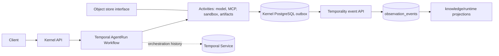

# Agent Kernel and Temporality architecture

Status: initial architecture decision, 2026-09-24. The implementation is incremental; this document is the target for the new kernel, not a claim that every box exists today.

## Decision in one page

- Build a small Go Agent Kernel in this repository. Go fits the existing runtime and PostgreSQL code and has first-party Temporal and MCP SDKs.
- Use Temporal for managed agent runs and long waits. One run is a Workflow; a model turn is a deterministic workflow step with model/tool side effects behind Activities. Do not create a Workflow for every turn or tool call.
- Keep `temporality.event/1` HTTP/JSON as the portable producer contract. Kernel-native typed events map to that contract; other harnesses remain able to emit it without adopting this Kernel.
- Keep Temporal's workflow history for orchestration recovery. PostgreSQL `observation_events` remains the semantic source of truth for Temporality projections.
- Treat an event outbox as part of the Kernel's durability boundary. Never assume an external side effect and an HTTP event append can commit atomically.
- Store payloads and artifacts behind references. PostgreSQL keeps bounded metadata, event identity, hashes and causal links.
- Start with an interface-based model client compatible with OpenAI APIs. LiteLLM can be deployed as an optional gateway; the Kernel does not import or require it.
- Use the official MCP Go SDK behind a Kernel tool interface. Require an explicit permission profile for every server/tool.
- Keep sandbox execution behind a replaceable Runner interface. The current optional Docker CLI backend requires an image pinned by digest and a workspace under an administrator-configured root; it disables networking, drops capabilities, makes the container root read-only, sets resource limits and requires approval for commands. A live approved command smoke test passed on 2026-09-24. Adversarial security validation remains outstanding, so this is not a production security-boundary claim.

## Execution model

`AgentRun` is the durable boundary. It accepts a stable `run_id`, project/task/actor context, an idempotency key and a bounded initial input reference. Workflow code owns the loop state and decisions; it must be deterministic. Model, MCP, sandbox, artifact and outbox I/O are Activities with explicit timeouts and retry policies. A retry of a side-effecting Activity carries a stable operation ID and requires an idempotent downstream operation or a reconciliation step.

Short interactive work still runs as a Workflow when the caller asks for a managed run. This avoids two execution semantics and gives recovery at the cost of Temporal round trips. A separate in-process fast path is deferred until latency is measured and a real need is shown. A turn is not its own Workflow: it is a sequence of workflow decisions and Activities inside `AgentRun`.

Delegation maps to child Workflows with stable child IDs and explicit parent/child context. Human approval is a durable wait on a Temporal Signal/Update, with timeout and cancellation; it is not disguised as a tool call. The exact public API choice (Signal vs Update) is a PoC item because Updates provide a request/response validation path while Signals fit asynchronous decisions.

## Kernel boundaries

The Kernel owns run state, tool policy, model/tool orchestration, approval, delegation, context limits and emission of canonical event intent. Adapters own provider-specific calls. Temporality owns the durable semantic journal and temporal projections. Temporal owns durable workflow execution and recovery. OTel spans/metrics/logs correlate to Temporality event IDs but do not define knowledge semantics.

## Event delivery and effects

The Kernel persists an outbox intent before executing a consequential external effect. After the effect, it records the result and artifact reference in the outbox. A publisher retries delivery to Temporality at least once; `(source.id,event_id)` deduplication makes replay safe. For an external effect without an idempotency or reconciliation mechanism, the Kernel marks the result as uncertain after a crash and requires a policy decision; it must not silently repeat a non-idempotent write.

This is an eventual event delivery guarantee, not a distributed transaction between Temporal, the Kernel database, an external tool and Temporality. The outbox closes the gap between local durable intent and event publication. If the outbox database itself is unavailable before an effect, the default for writes is fail closed. Read-only work may be configured to continue with a recorded observability gap once storage returns.

## Storage

- PostgreSQL: kernel outbox and idempotency records; existing FRP data; Temporality semantic events and rebuildable projections. Keep kernel ownership and Temporality ownership explicit even if they initially share a server.
- Object store: artifacts larger than the event budget, via a generic S3 API. Local filesystem backend for development. Do not standardize on MinIO: its upstream repository was archived in April 2026 and is AGPL-3.0; select an actively maintained S3-compatible service per deployment.
- No separate graph database, vector database, Kafka or NATS in MVP. Add embeddings only after retrieval evaluation; add a broker only when measured consumer fan-out/backpressure requires one.

## Components and PoC scope

First vertical: start run -> model call -> tool/sandbox -> approval -> event outbox -> Temporality timeline -> retrieve knowledge as separate context -> finish/replay. MCP, sandbox and child-workflow example code now exist as opt-in capabilities; the complete multi-service and security validation remains outstanding.

## Relationship to the universal adapter

`docs/history/pivot/09-universal-observability-plan.md` remains valid as the cross-harness ingestion/activation contract. Its statement that the agent loop stays outside Temporality is unchanged. This document adds one first-party Kernel producer; it does not make FRP Frames, Temporal IDs or this Kernel mandatory for third-party producers.

## Open implementation questions

1. Should API start return after Temporal accepts the Workflow or wait for the first frame? PoC should expose both `start` and status/stream reads.
2. Should outbox share the existing database or use an independent Kernel database? Initially share PostgreSQL operationally but use a separate schema/table and no cross-domain transactions.
3. Which activity outputs require object storage by default? Set thresholds and redaction policy before sending real prompts/results.
4. Which sandbox backend is available in the deployment environment? The interface is fixed first; production default cannot be host shell.
