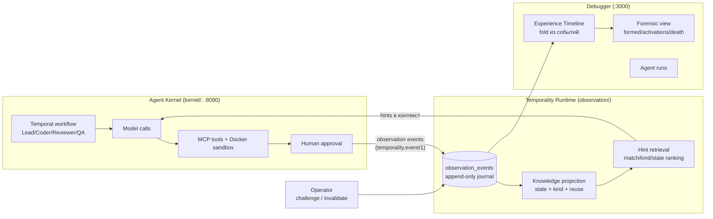

# Архитектура Temporality — инвентаризация и расчистка (2026-09-25)

Этот документ — честная карта того, что находится в репозитории сейчас:
какие подсистемы образуют доказанный продукт, какие остались от прошлых
гипотез, и что предлагается с этим делать. Отправная точка — не планы, а
фактический код и фактические результаты экспериментов 4–8.

## 1. Что сегодня является продуктом

Продукт Temporality — это замкнутый контур **agent memory loop** с полной
наблюдаемостью эволюции опыта. Он доказан пятью acceptance-корпусами
(эксперименты 4–8) и выглядит так:

Доказанные свойства контура (по корпусам exp4–exp8):

- формирование опыта, кросс-рановый recall и reuse;
- селективная смерть, supersession-цепи и рёбра, resurrection (полный круг
  `LH_TOKEN → .lh-token → LH_TOKEN`), staleness, конкуренция заметок;
- составная смерть (одна заметка — два преемника, два lineage-ребра из
  одного reason);
- гигиена retrieval после invalidation (мёртвое не возвращается);
- масштаб: 20 строк знаний / 110 активаций (forge), длинный горизонт:
  3 версии CLI / 11 ранов (lighthouse);
- kernel-дедупликация canonical-команд и claim-first hint budget.

Слоган, подтверждённый этим кодом, прежний:

> Основная сущность визуализации — опыт. Основное измерение — время.
> Траектория агента и память — два слоя одного временного пространства.

## 2. Три эпохи гипотез, наслоившиеся в одном репозитории

**Эпоха 1 — FRP v0.3, «новый runtime эффективнее классического harness».**
Milestones M0–M15: event log, replay, claims, frames, attention, render,
execution, planner, procedures, time travel, branches, worlds, entities,
ingest. Гипотеза опровергнута собственным бенчмарком (см. корневой
`Отчет об эффективности FRP 2026-09-16.md`): полный FRP дороже классики по
токенам и времени, claims/procedures не переиспользуются. Осталось
~28.7k LOC в `frp/` (159 файлов, 20 подсистем) и HTTP API из ~40 эндпоинтов.

**Эпоха 2 — pivot к temporal-semantic memory + AML-эксперименты.**
`pivot.md`, `docs/pivot/*` (10 документов), AML-хarness (`aml/`, ~5.7k
LOC), бенчмарки `benchmarks/aml-*.json`, отчёты `docs/benchmarks/aml-*`
(2026-09-19). Из этой эпохи в живом продукте остался один пакет:
`aml/llm` (329 LOC) — OpenAI-совместимый клиент, которым пользуется kernel.

**Эпоха 3 — текущий продукт: observation journal + kernel + Experience
Timeline.** Universal observation API (migration 000018), Agent Kernel,
 debugger `/experience`, `/agents`, `/observability`, эксперименты 4–8,
 forensic view, lens-фильтры. Это единственная эпоха с работающим
 end-to-end контуром и acceptance-тестами.

Проблема не в том, что эпохи существовали, а в том, что они **не
разделены**: runtime одной сборкой обслуживает FRP и продукт, debugger —
один сайт на четыре страницы из трёх эпох, документация корня описывает
статус FRP-мильстоунов, а не продукт.

## 3. Инвентаризация

Размеры — LOC Go/TS без тестов-артефактов; статусы: **ядро** (продукт),
**поддержка** (нужно продукту, но чужое место), **legacy** (прошлая
гипотеза, не на продуктовом пути), **шум**.

| Путь | Размер | Эпоха | Статус | Комментарий |
|---|---|---|---|---|
| `kernel/` | 3.1k | 3 | **ядро** | workflow, activities, heuristics, approval_preview, mcpclient, outbox, sandbox |
| `cmd/agent-kernel/` | ~0.5k | 3 | **ядро** | точка входа kernel (:8090) |
| `observation/` | 1.0k | 3 | **ядро** | event, store, cursor, hints, knowledge (projection + ranking) |
| `frp/runtime/httpapi` (observation endpoints) | часть | 3 | **ядро** | 5 эндпоинтов `/v1/observations/*` живут внутри FRP-сервера |
| `frp/substrate/` (postgres, memory) | 5.5k | 1/3 | **поддержка** | хранилище: event store FRP + observation_events; нужен продуктy |
| `debugger/src/ExperienceTimeline.tsx` + `experience.ts` | ~3.5k TS | 3 | **ядро** | главный экран продукта + fold + forensic |
| `debugger/src/AgentRuns.tsx`, `Observability.tsx` | ~1.3k TS | 3 | **ядро** | раны kernel и knowledge observability |
| `schemas/` | 19 файлов | 3 | **ядро** | `temporality.event.v1.schema.json` — контракт продукта |
| `examples/experiment4..8/` + `scripts/exp6..8/` | — | 3 | **ядро** | acceptance-корпуса и драйверы |
| `migrations/000018_observation_events` | 1 файл | 3 | **ядро** | схема журнала |
| `examples/javascript`, `examples/python` | — | 3 | **поддержка** | dependency-free клиенты universal API |
| `examples/test-mcp` | — | 3 | **поддержка** | fixture для MCP-интеграционных тестов kernel |
| `examples/code-change`, `lead_coder_reviewer_qa` | — | 3 | **поддержка** | Phase 2 acceptance (calculator, delegation) |
| `aml/llm/` | 0.3k | 2 | **поддержка** | LLM-клиент kernel; живёт в legacy-дереве |
| `frp/*` (остальные 19 подсистем) | ~23k | 1 | **legacy** | frames, attention, render, world, cognition, execution, timetravel, branch, procedure, planner, objective, affordance, entity, replay, projection, protocol, model, ingest, frame |
| `cmd/temporality-runtime/` | ~0.1k | 1/3 | **поддержка** | подаёт FRP API + observation API одной сборкой |
| `cmd/temporality-executor/` | ~0.1k | 1 | **legacy** | исполнитель FRP-affordances; kernel не использует (своя sandbox) |
| `aml/*` (кроме llm) | ~5.4k | 2 | **legacy** | coding, harness, memory, opsenv, sidecar, temporality |
| `cmd/aml-bench`, `aml-coding-bench`, `aml-sidecar` | ~1.5k | 2 | **legacy** | бенчмарк-инструменты эпохи AML |
| `debugger/src/App.tsx` (Cognitive Debugger) | ~2k TS | 1 | **legacy** | FRP-страница: episodes, frames, attention, render |
| `debugger/src/Investigation.tsx`, `trajectory.ts` | ~0.7k TS | 2 | **legacy** | pivot-этап 5, построен на FrpEvent |
| `benchmarks/` (aml-*.json, aml3) | 36 файлов | 2 | **legacy** | результаты AML-прогонов |
| `scripts/` (aml_*, benchmark, memory_benchmark, token_benchmark, realrepo*, first_contact) | 11 py | 2 | **legacy** | драйверы бенчмарков прошлых эпох; `model_smoke.py`, `smoke.py` — живые |
| `docs/` (architecture, contract, knowledge-model, event-model, failure-model, approval-model, replay-model, validation-report, experiment4-8, decisions/) | ~30 док | 3 | **ядро** | актуальная документация продукта |
| `docs/pivot/` | 10 док | 2 | **история** | ценно как хроника, не продукт |
| `docs/benchmarks/` (aml-*) | ~8 док | 2 | **legacy** | отчёты AML |
| корень: `Frame Runtile Protocol FRP v0.3.md`, `Архитектура FRP v0.3.md`, `FRP_Longitudinal_Memory_Benchmark_TZ.md`, `Отчет об эффективности FRP…`, `План развития M11-M15.md`, `Roadmap_ от M10…`, `pivot.md`, `temporality-pivot-tz.md`, `ROADMAP.md` | 9 док | 1–2 | **шум** | разные эпохи на самом видном месте; `README.md` описывает FRP-статус |
| `docs-placeholder` (пустой файл) | 0 | — | **шум** | удалить |
| `bin/` | — | — | — | gitignored артефакты сборки, ок |

Итого: из ~45k LOC Go в репозитории на продуктовом пути стоит примерно
**9–10k** (kernel + observation + субстрат + runtime-точка входа + llm).
Из ~4.8k LOC TypeScript в debugger продуктовые — примерно **2.5k**.

## 4. Конкретные проблемы текущей структуры

1. **Продукт живёт внутри legacy-сервера.** Observation API — это 5
   хендлеров внутри `frp/runtime/httpapi/server.go`, которые делят binary,
   миграции (17 FRP-миграций до 000018) и идентичность («protocol frp» в
   логах) с 35+ эндпоинтами мёртвой гипотезы. Любая разработка продукта
   редактирует legacy-код.
2. **Именование эпохи 1 выдаёт себя за продукт.** `VITE_FRP_API_URL`
   указывает на observation API; debugger называет себя «TEMPORALITY /
   FRP»; README начинается со статуса FRP-мильстоунов; `ROADMAP.md` —
   FRP-план. Новый инженер (или вы через месяц) не сможет отличить
   продукт от истории.
3. **Debugger — витрина трёх эпох без указателя.** `/` (FRP Cognitive
   Debugger) открывается по умолчанию, тогда как продукт — это
   `/experience`. Заголовок Experience Timeline ссылается на «FRP
   debugger» как на равного соседа.
4. **`aml/llm` — единственный живой код эпохи 2** — живёт в полностью
   legacy-дереве и тянет за собой три legacy-бинарника в `cmd/`.
5. **Дубли документации.** Одни и те же решения описаны в корневых
   русских ТЗ, `docs/pivot/*` и `docs/decisions/*` — с разными выводами.
6. **Пустой tracked-файл `docs-placeholder`** и корневой каталог из 9
   документов четырёх эпох вперемешку с кодом.

## 5. Расчистка — выполнено (2026-09-25)

Стадии A–C выполнены одной операцией (см. git log от `dc01ff2`):

- **Извлечён journal**: `observation/httpapi` + `observation/postgres`
  (embedded-миграция) + `observation/memory` (тесты) +
  `cmd/temporality-journal`; compose-сервис `runtime`/`executor` заменён на
  `journal`; debugger nginx проксирует `/api/` на journal.
- **Kernel отвязан от эпохи 2**: `aml/llm` → `kernel/llm`.
- **Удалено** (~40k LOC): `frp/`, `aml/`, `cmd/temporality-runtime`,
  `cmd/temporality-executor`, `cmd/aml-*`, `benchmarks/`, legacy-скрипты
  (их эндпоинты жили на FRP-сервере), FRP-страница debugger и её модули,
  `docs-placeholder`. Makefile собирает journal + agent-kernel.
- **Доки**: история эпох 1–2 в `docs/history/` (ТЗ, отчёты, pivot-серии,
  aml/frp-бенчмарки); продуктовые доки остаются в `docs/`.
- Продуктовый контур больше не компилирует ни одного legacy-пакета.

## 5a. Соответствие целевой корпоративной архитектуре

Целевая нарезка (см. §6) и текущий код:

| Слой (цель) | Сегодня в коде | Заметки |
|---|---|---|
| Temporal — durable execution | `temporal` в compose; kernel workflow | уже так |
| Agent Harness — Agent Model | `kernel/agent` (generic + Lead/Coder/Reviewer/QA под build-тегом) | roles/skills — гипотезы эпох 2, оставить только доказанное |
| Agent Harness — Execution | `kernel/mcpclient`, sandbox (`run_command`), `kernel/llm` gateway | model gateway = `kernel/llm` |
| Agent Harness — Orchestration | Temporal workflow, delegation в `kernel/agent/workflow.go` | parallelism/policies — по мере надобности |
| Agent Harness — Control | approval (requested/granted, redacted preview), budgets (turns) | behavioral SLO/policy enforcement — будущие стадии |
| Agent Harness — Evidence & Observability | observation events, kernel event outbox (миграция 000019) | evidence package / replay — частично (Experience Timeline) |
| Temporality — опыт и память | `observation/` (journal, knowledge, hints) + Experience Timeline | ядро продукта |
| Enterprise Control Plane | `controlplane/`: bearer-токены, роли reader/writer/operator/admin, project-scoping на journal и kernel API | минимум 2026-09-25: auth + RBAC готовы (JOURNAL_AUTH_TOKENS / KERNEL_AUTH_TOKENS / TEMPORALITY_API_TOKEN); остались tenants, secrets вне .env, quotas |
| Infrastructure | docker compose | при развёртывании заменить на целевые среды |

Scheduling не выделяется в отдельный блок harness: cron/schedules/events
естественно живут на стороне Temporal; harness определяет только что
запускать и с какими параметрами.

## 6. Что развивать как продукт (и что нет)

Развивать — только то, что усиливает доказанный контур §1:

1. **Experience Timeline** — главный экран: lens-режимы уже есть
   (trajectory/experience/lifecycle/conflicts/activation + пресеты
   activation-only/conflicts-only + фильтры scope/memory state/search +
   population lane). Следующее: semantic zoom глубже cluster → episode →
   event; сохранение/шаринг вью (URL state).
2. **Forensic view** — уже кликабелен (evidence/episodes наводят на
   таймлайн). Следующее: activation chain как первый класс (memory →
   decision → action → outcome одним взглядом).
3. **Kernel memory loop** — hint budget (claim-first ranking доказан на
   forge/lighthouse), dedup canonical-команд (доказан на lighthouse).
   Развивать только там, где мешает наблюдаемости: model-call
   observability, MCP provenance, failure/reconciliation (P0/P1 из
   phase2-status).
4. **Эксперименты как acceptance-корпуса** — exp9 (множественные
   конкурирующие опыты на длинном горизонте) следующим, каждый корпус —
   fixture + тесты + дока, как exp4–8.

Не делать (решения уже приняты фазовыми планами и подтверждены кодом):
универсальный knowledge graph, embeddings-инфраструктура, graph DB,
автокластеризация, новый runtime, «ещё один debugger».

## 7. Открытые решения за пользователем

Открытые вопросы стадии A–C сняты решениями от 2026-09-25: executor и
FRP-страница удалены, `aml/` удалён, расчистка сделана до exp9.

Следующий открытый фронт — «используемый продукт»:

1. **Развёртывание для команды** вместо новых экспериментов: env-конфиг,
   .env.example, документация запуска, реальные проекты вместо
   gatekeeper/lighthouse фикстур. Auth/RBAC включены переменными из
   .env.example (см. README → Auth).
2. **Enterprise Control Plane**: bearer auth + роли + project-scoping на
   journal/kernel готовы (`controlplane/`, 2026-09-25); остаются tenants
   как отдельная сущность, secrets вне .env, quotas.
3. **Kernel P0/P1** только там, где мешает наблюдаемости: model-call
   observability и MCP provenance сделаны (2026-09-25: model.completed
   несёт provider/latency/token split/content refs/attempts/truncated;
   mcp.call.* — server + result_ref + result_bytes); осталась
   failure/reconciliation семантика.
